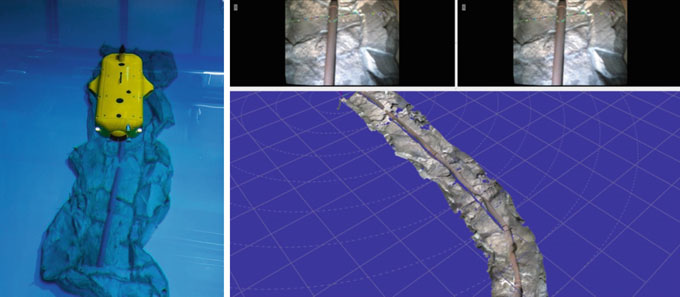

# AI technology for underwater robots

​	*This book is trying to outline the **possibilities for AI** in a field that for now has been left **pretty much untouched** by these technologies but that offers great potential for the field of AI as well as it will profit enormously from these applications, especially in combination with modern robotic technologies.*

​	*...to enable more robust systems exploiting properties like **self-healing instead of withstanding** the harsh underwater environment...*

##  Challenges and Potentials

​	**A Survey of Challenges and Potentials for AI Technologies**

​	*...many times before we know much less about the bottom of our oceans as we do know about the surface of Mars...*

> This expansion and development will pose some serious research questions on the side of the current AI and Robotic technologies and methods however, the solutions to those questions will on the other hand not just **expand AI and robotics**, moreover it will actually allow us to **formulate new directions of research** and therefore **answer some pressing questions on the perspectives for Artificial Intelligence itself.**

​	...3D reconstruction technologies based on AI-methods known from terrestrial systems, like structure from motion, 3-D vision, and multi-modal (laser and ultrasound) scanning techniques...(p8)

​	...we can make use of modern learning and AI-Techniques to predict the occurrence of failure, a technique that is called predictive maintenance that is used e.g. in train systems already today...(p8)

**Intelligent Sensor Technology: A ‘Must-Have’ for Next-Century Marine Science**

**Challenges for Deepwater Operations: An Industry Perspective**

**Intelligent Skin—Advanced Materials and Manufacturing for a Modular and Multipurpose Hull**

**Modular and Reconfigurable System Design for Underwater Vehicles**

**Intelligent Propulsion**

**Challenges and Opportunities in Communications for Autonomous Underwater Vehicles**

**Modular Underwater Manipulators for Autonomous Underwater Intervention**

**Machine Learning and Dynamic Whole Body Control for Underwater Manipulation**

**Adaptive Control for Underwater Gripping Systems**

**Challenges in Underwater Visual Navigation and SLAM**

**Underwater Multi-modal Sensing for Environmental Mapping and Vehicle Navigation**

**Towards a Simulation Framework for Underwater Intervention Analysis and Training**

**Novel Directions for Autonomous Underwater Vehicle Navigation in Confined Spaces**

**Verification for Autonomous Underwater Systems**

**An Interactive Strategic Mission Management System for Intuitive Human-Robot Cooperation**