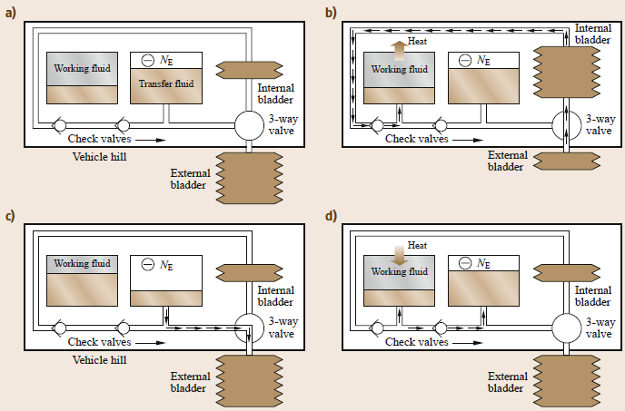
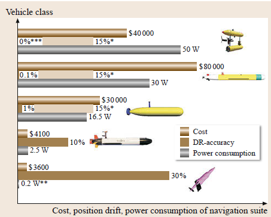

# 无人潜水器

- **7个子系统：推进器、传感器、能量、导航、通信、控制、自治**

## 一、高机动性仿生水下航行器

> 人工肌肉技术发展乏力、对非线性时间控制和传感以及拉两者如何整合缺乏理解均制约了仿生机器人方法的巨大潜力。

​	**仿生平台&生物启发平台**p3

​		生物启发指对科学知识进行提炼并在有助于用户的框架中得到应用，生物启发平台不需要模拟任何生物。相反，仿生最重要的特点是模拟生物，仿生平台需模拟所选择的生物。后者容易吸引公众关注，并且在伪装方面是有价值的。

​		根据经验，实用的研究指可用数学公式表达对机制的理解。比例规则及理解周期平均过程对于设计和控制非常有帮助。**只要有可能，应在作业范围内对全尺寸执行器进行实验修正**，以便制定可靠的控制规则。本章并未使用计算流体动力学，因为实际上这只是后测而非预测。

​		人们在进行仿生推进器变形驱动研究时就非常关注执行器材料(如人工肌肉)的重要性。但离子聚合物或更先进的碳纳米技术尚不能应用于尺寸达到1m的平台。

​		海军使用的长度远小于1m的平台还没有得到验证。这可能是由于可用驱动材料之间为刚性和高柔性边界。系统所考虑的问题表明有些方法(如乌贼的喷射水流)的效率不如摆动鳍(鱼类可将更多动量传递到水中，无内部水囊大小的限制)，无法使尺寸增加(乌贼的耗氧率比鱼类高5~7倍)。此外，开发容易受海水腐蚀或因生物生长而堵塞的方法也无益处，长期暴露于自然海洋环境通常会出现这些问题。

​		虽然传统PID控制器已成功应用于摆动鳍(产生振荡力)，但采用橄榄体小脑动力学来控制摆动鳍产生的瞬时不稳定力可使无人水下航行器更为仿生。这可以为整合非线性传感器提供逻辑性更好的基础，使航行器控制器更可靠，对不稳定环境干扰的反应更好。理论上，自治是非线性振荡器自调节性所产生结果。

## 二、自主水下滑翔机

​		翼的涡旋动力学比螺旋桨简单，滑翔机在运输效率上具有内在的优势。

​		可采用的浮力发动机技术有多种，包括闭式回路基于液体的发动机，性能为0.1%-4%；开式回路基于海水的浮力发动机，例如XRay和ZRay所用的发动机，性能通常为1%-8%;开式回路基于压缩气体的系统，5%-20%;以及开式回路基于气体的浮力发动机，需消耗可产生气体的化合物，例如 Concept Whisper所用的发动机，11%-28%。（P27）

​		螺旋桨旋涡尾迹中的额外涡量分量导致耗散率更高，为了使水中航行器保持既定速度需要消耗更多携带的能量。通过自然界中海洋哺乳动物推进系统的进化可以表明**在水中翼的运输效率要优于螺旋桨**，如蓝鲸。蓝鲸进化出翼尾(鲸尾叶突)而非螺旋桨作为其推进系统的基础。**对翼尾的自然选择不是因为关节缺乏360°旋转的能力，灵长类动物的肩关节明确证明了这在生物力学上是可行的**。

​		

​		海洋的稳定分层使湍流干扰较小，因而不太需要进行航行控制。（P29）

​		几乎所有材料都具有正热膨胀系数,因而熔化导致体积增加,凝固导致体积减小(低于4℃的水是例外情况)。因为体积变化与滑翔机浮力发动机所需的相反,所以无法直接用于向前推进。热力循环的四个阶段如图所示。

​		

## 三、自主水下航行器导航

#### 1.可用的五种技术

- 本体感受传感

- 全球定位系统

- 声学应答系统

- 基于地图的导航

- SLAM

  本体感受系统按价格分两种主流配置：惯导+DVL；磁罗盘/AHRS。

​        航迹推算（DR）典型导航误差（本体感受传感，声学打底）为航程0.5%~2%，更好的设备能达到0.1%，对仅依靠罗盘和速度估计值得航行器，误差可高达10%。

#### 2. 算法

- 航迹推算和惯性导航

  典型漂移率为1km/h，(核潜艇可能为0.01km/h)，与DVL结合精度可达0.01%。

- 声学导航

  LBL工作频率通常10kHz，最大工作范围几千米，位置精度几米，由于浅水复杂的传播效应和地形影响，LBL在深水效果更佳。

- 基于地图的导航

  典型实现：多波束得到精确的海床剖面，再与预先绘制的地图进行匹配。（想法源于导弹制导，Bergem）

- SLAM

- 多航行器协同导航

  一般而言，协同导航基于一艘航行器的位置估算精度高于另一艘；

  两种策略：一组专用导航航行器（NA）提供导航信息；相互平级。

#### 3.五种典型导航配置

- 极低功率传感器套件的滑翔机

  罗盘+姿态传感器

- AUV低成本传感套件

  罗盘+姿态传感器+流量计

- 标准AUV传感套件

  惯导+DVL+LBL

- 高端AUV

  光纤惯导（更换光纤陀螺仪提高两个数量级精度）+DVL+LBL

- 使用SLAM的特殊任务AUV

  惯导+DVL+SLAM（可再次前往去过的位置）（如SeaBed！）

  

  挑战：适用两极的导航技术。磁偏角较大、无法上浮至水面获取GPS、无法部署应答器、遭遇流冰群、回收受限。

