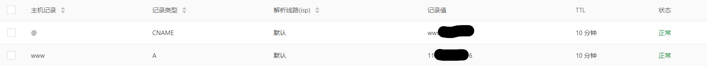
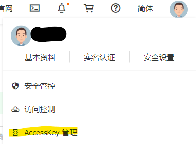

# QNAP笔记

## 使用阿里云DDNS

**1.在阿里云上申请一个域名，并做实名认证；**

**2.实名认证通过后，进行域名解析设置：**



主机记录www的记录值随便填写一个ip地址；

@记录值填写带www的完整域名。

**3.在阿里云个人资料栏下获取或生成AccessKey和Access key Secret**



**4.在QNAP中启用ContainerStation，并SSH至NAS，输入下述两行代码：**

```dockerfile
docker pull chenhw2/aliyun-ddns-cli

docker run -d \
    -e "AKID=[ALIYUN's AccessKey-ID]" \
    -e "AKSCT=[ALIYUN's AccessKey-Secret]" \
    -e "DOMAIN=ddns.aliyun.win" \
    -e "REDO=600" \
    chenhw2/aliyun-ddns-cli
```

[ALIYUN's AccessKey-ID]替换成自己的AccessKey，[ALIYUN's AccessKey-Secret]换成Access key Secret，ddns.aliyun.win换成完整域名。


稍后即可使用www.domain.com 或 domain.com 加相应端口号访问自己的NAS了。


**注：**

- 我最先在ContainerStation获取了aliyun-ddns-cli的docker，再用第二行代码设置自己的docker，结果不断提示404错误：<u>UserNotFound  The specified user can not be found.  404  指定用户找不到  根据输入的用户信息找不到该用户。</u>  发现环境变量没有被正确设置。（然后我不会修改docker的环境变量=。=，遂按上述步骤成功完成设置）；

- 若docker控制台显示错误：Status Code: 400 Code: InvalidTimeStamp.Expired Message: Specified time stamp or date value is expired. 将NAS时间设为自动获取即可。

  

------


## Webdav 的使用

- ### Nextcloud在window 10资源管理器的挂载

> *从Windows Vista起，微软就禁用了http形式的基本WebDAV验证形式（KB841215），必须使用https连接，但是架设在AppFog上的免费账户对SSL证书无权限。所以在Windows Vista/7/8中，要方便地映射NextCloud文件为系统上的“网络位置”，就必须改注册表……*

**1.开启服务**
		此电脑右键-管理-服务-WebClient 设为自动

**2.修改注册表**

> **a.打开注册表编辑器。**
> 转到**开始 > 运行**。
> 输入 **regedit**。
> 单击确定。
> 如果打开“用户帐户控制”窗口，单击**是**。
> 此时会打开注册表编辑器。
> b.导航到**HKEY_LOCAL_MACHINE\SYSTEM\CurrentControlset\services\WebClient\Parameters**。
> c.选择 **BasicAuthLevel**。
> d.将值改为 **2**。
> e.重新启动计算机。
> f.从 Windows 7 连接到 WebDAV 文件夹。

**3.补充**

> *在某些版本的 Windows 操作系统中，WebDAV 驱动器的最大文件大小被限制为 50MB。如果你试图复制超过 50MB 大小的文件，Windows 就会弹出错误提示框。当然，这个限制是可以通过修改注册表来消除的。将注册表中位于*
> *HKLM\SYSTEM\CurrentControlSet\Services\WebClient\Parameters\FileSizeLimitInBytes*
> *处的键值由 50000000 (50MB) 修改为更大的数值。最大修改为：4294967295（0xffffffff）字节，即4G。*

- ### Linux挂载

在Linux下可以使用 davfs2 挂载目录。

> 1.安装：**apt install davfs2**
>
> 2.执行命令后系统会自动安装，出现提示，选**是**。
>
> 3.在当前主目录新建一个**webdav**的文件夹，然后使用命令：
>
> ```powershell
> sudo mount -t davfs http://192.168.2.230:81/remote.php/webdav ./webdav/
> ```

